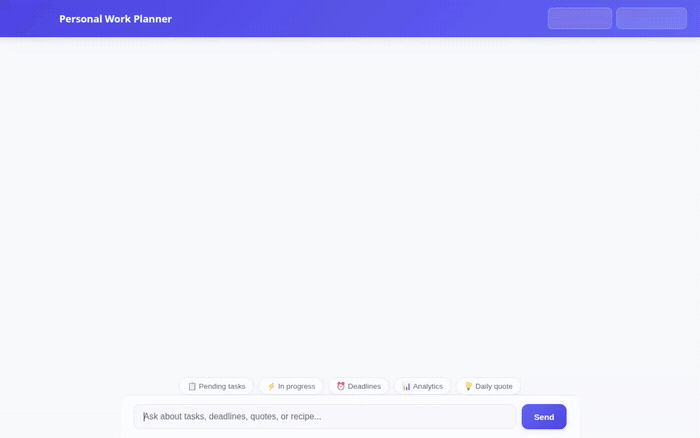

# Personal Work Planner Agent

A smart personal work management assistant built with the **Google Agent Development Kit (ADK)**, Vertex AI, and Google Cloud services. The agent manages task backlogs, calculates workload analytics, grounds domain lookups, generates visual task banners, exports cloud reports, and renders rich structured UI components using **A2UI**.



---

## 🌟 Features & Architecture

The **Personal Work Planner Agent** integrates the following core capabilities:

### 1. 🗄️ Task Backlog & Persistence (Google Cloud Firestore)
- **`list_tasks(status, priority)`**: Queries task documents filtered by status (`Pending`, `In Progress`, `Completed`) or priority (`High`, `Medium`, `Low`).
- **`create_task(title, description, priority, due_date, status)`**: Creates new structured task records with unique IDs and ISO timestamps.
- **`update_task_status(task_id, status)`**: Updates task progress state in real time.
- **`get_upcoming_deadlines(days_ahead)`**: Filters pending tasks due within a specified window and calculates remaining days.

### 2. 📊 Workload Analytics & Sandbox Execution (ADK Code Executor)
- **`calculate_workload_analytics()`**: Computes task completion velocity, high-priority backlog density, and remaining effort hours.
- **Agent Engine Sandbox**: Executes custom Python data processing and mathematical calculations safely within a sandboxed environment.

### 3. 🎨 AI Image Generation & Assets (Vertex AI + Cloud Storage)
- **`generate_task_image(description)`**: Uses the `gemini-3.1-flash-lite-image` model on Vertex AI to generate custom visual illustrations for tasks.
- **Google Cloud Storage Upload**: Automatically uploads generated images directly to a Cloud Storage bucket and returns public HTTPS asset links.

### 4. 📄 Productivity Report Publishing (Google Cloud Storage)
- **`export_productivity_report(report_title)`**: Formats active tasks into an HTML dashboard report and publishes it to Google Cloud Storage.

### 5. 🔍 Recipe Grounding & RAG Retrieval
- **`consult_recipe_corpus(query)`**: Grounded retrieval tool that searches meal prep guides and nutritional breakdown specifications for team wellness planning.

### 6. 🧠 Long-Term Memory Bank & Context
- **`PreloadMemoryTool` & Memory Callbacks**: Automatically persists user session context and preferences across interactions into a long-term memory bank.

### 7. 🌐 ZenQuotes Focus API Integration
- **`get_daily_motivation_quote()`**: Fetches daily motivational and focus quotes for work kickoffs.

### 8. 📱 Structured A2UI Rendering & Web Frontend
- **A2UI Schema Manager (`a2ui_callback`)**: Automatically transforms agent output into structured JSON UI components (Cards, Columns, Text, Images).
- **FastAPI Chat UI**: A lightweight, modern frontend featuring:
  - 🌙 Light / Dark Mode Toggle
  - ⏳ 3-Dot Animated Typing Pulse
  - 🔴🟡🔵 Dynamic Priority & Status Pill Badges
  - ⚡ Clickable Quick Prompt Chips
  - 🧹 Clear Chat / Reset Session Action

---

## 📁 Repository Structure

```
work-planner-agent/
├── app/
│   ├── agent.py                 # Core ADK Root Agent definition & instructions
│   ├── a2ui_utils.py            # A2UI callback and schema processing
│   ├── tools/
│   │   └── firestore_tools.py   # Firestore, GCS, Image Gen & RAG tools
│   └── data/                    # Grounded RAG dataset files
├── frontend/
│   ├── main.py                  # FastAPI proxy server for A2UI & A2A protocol
│   ├── Dockerfile               # Container build configuration for frontend
│   ├── static/
│   │   └── index.html           # Rebranded HTML/CSS/JS Chat Interface
│   └── requirements.txt
├── assets/
│   └── demo.gif                 # Recorded demo walkthrough GIF
├── agents-cli-manifest.yaml     # ADK Agent CLI project manifest
├── Dockerfile                   # Agent runtime container configuration
├── pyproject.toml               # Python dependencies (adk, google-cloud-*)
└── README.md
```

---

## 🛠️ Local Setup & Running

### Prerequisites
- Python 3.11+
- Node.js 18+ (for frontend assets & demo recording tools)
- Google Cloud SDK (`gcloud`) authenticated with a GCP Project

### 1. Install Dependencies

Set up Python virtual environment and install project dependencies:

```bash
# Set up Python virtual environment
python -m venv .venv
source .venv/bin/activate

# Install requirements
pip install -e .
pip install -r frontend/requirements.txt
```

### 2. Configure Environment Variables

Create a `.env` file in the root directory:

```env
GOOGLE_CLOUD_PROJECT=your-gcp-project-id
GOOGLE_CLOUD_REGION=us-east1
```

### 3. Run the Agent & Frontend Locally

Start the local FastAPI Proxy and Chat UI server:

```bash
cd frontend
python main.py
```

Open your browser and navigate to `http://localhost:8080` to interact with the Work Planner agent interface locally.

---

## ☁️ Deployment

### Deploying the Agent Engine
Deploy the agent engine to Google Cloud Agent Runtime:

```bash
agents-cli deploy
```

### Deploying the Frontend to Cloud Run

Build and deploy the FastAPI frontend service to Cloud Run:

```bash
gcloud run deploy work-planner-frontend \
  --source ./frontend \
  --region us-east1 \
  --allow-unauthenticated \
  --set-env-vars AGENT_ENGINE_RESOURCE_NAME="projects/<PROJECT_NUMBER>/locations/us-east1/reasoningEngines/<ENGINE_ID>",AGENT_DIRECTORY="app"
```

---

## 📜 License

Licensed under the Apache License, Version 2.0.
